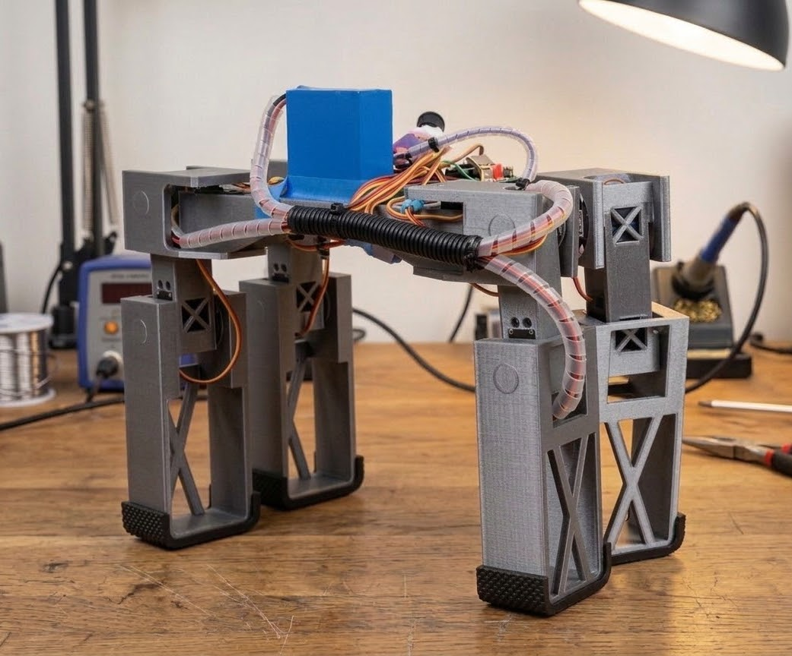

# sim2real-quad 🤖

> A 3D-printed quadruped robot that learns to walk in simulation and runs on real hardware.




https://github.com/user-attachments/assets/a061e2cf-527f-410b-b125-ff09861a9271

---

## What is this?

This is a personal robotics project by **Kyaw Linn Khant** — a fully functional 12-joint walking robot built from scratch. The robot's brain is a neural network trained entirely inside NVIDIA Isaac Lab, then exported and run live on physical hardware through ROS2 and an Arduino-controlled servo driver.

No motion capture. No hand-coded gaits. Just reinforcement learning.

---

## How it works
```
Simulation (Isaac Lab)
        ↓
  Train policy via RSL-RL (999 episodes)
        ↓
  Export as PyTorch .pt model
        ↓
ROS2 AI Node (Ubuntu WSL)
        ↓
  Run inference at 20Hz
  Build 72D observation vector
        ↓
Hardware Interface Node
        ↓
  Convert joint targets → serial commands
        ↓
Arduino UNO R3 + PCA9685
        ↓
  12x MG996R Servos
        ↓
      Robot walks
```

---

## The Robot

| Property | Value |
|---|---|
| Joints | 12 (3 per leg: hip, knee, ankle) |
| Servos | MG996R × 12 |
| Controller | Arduino UNO R3 |
| Servo Driver | PCA9685 I2C |
| Power | External 6V supply |
| Chassis | 3D printed (STL files included) |
| URDF | 165 mesh components |

---

## The Brain

| Property | Value |
|---|---|
| Training Platform | Isaac Lab |
| Algorithm | PPO via RSL-RL |
| Observation Space | 72 dimensions |
| Action Space | 12 joint position targets |
| Control Rate | 20Hz inference |
| Training Time | ~20 minutes / 999 episodes |
| Export Format | PyTorch JIT (.pt) |

### Observation breakdown (72D)
```
Base linear velocity     →  3D
Base angular velocity    →  3D
Gravity vector           →  3D
Velocity commands        →  3D
Joint positions          → 12D
Joint velocities         → 12D
Previous actions         → 12D
Foot contact forces      → 24D
─────────────────────────────
Total                    → 72D
```

---

## Repo Layout
```
sim2real-quad/
│
├── arduino/                    ← Servo firmware (PCA9685 + serial parser)
│
├── hardware/
│   ├── stl_files/              ← Print these for the chassis
│   ├── cad/                    ← Editable CAD source files
│   └── urdf/                   ← Robot model + 165 mesh files
│
├── simulation/
│   ├── agents/                 ← PPO config
│   ├── assets/                 ← USD robot file
│   ├── trained_model/          ← policy.pt + policy.onnx
│   └── my_quadruped_config.py  ← Full Isaac Lab env config
│
├── ros2_workspace/src/
│   ├── ai_quadruped_controller.py    ← Loads model, runs inference
│   ├── quadruped_controller.py       ← Talks to Arduino
│   └── velocity_controller.py        ← Keyboard → /cmd_vel
│
└── media/                      ← Images and demo video
```

---

## Running It

You need three terminals:
```bash
# Terminal 1 — connect to Arduino and drive servos
ros2 run arduino_control quadruped_controller

# Terminal 2 — load the AI model and publish joint targets
ros2 run arduino_control ai_controller

# Terminal 3 — keyboard input
ros2 run arduino_control velocity_controller
```

### Keyboard Controls

| Key | Action |
|-----|--------|
| W / S | Forward / Backward |
| A / D | Strafe Left / Right |
| Q / E | Turn Left / Right |
| X | Gradual stop |
| SPACE | Emergency stop |

---

## Setup
```bash
# ROS2 Jazzy
sudo apt update && sudo apt install ros-jazzy-desktop

# Workspace
mkdir -p ~/ros2_ws/src && cd ~/ros2_ws/src
git clone https://github.com/KyawLinnKhant/sim2real-quad.git
cd .. && colcon build && source install/setup.bash
```

For Isaac Lab training setup, see [`simulation/`](./simulation/).

---

## Stack

| Layer | Tool |
|-------|------|
| Simulation | Isaac Lab (NVIDIA) |
| Training | RSL-RL (PPO) |
| Inference | PyTorch |
| Robot OS | ROS2 Jazzy |
| Dev Environment | Ubuntu 22.04 WSL |
| Hardware Interface | Arduino UNO R3 |
| Servo Driver | PCA9685 via I2C |

---


## License

MIT © 2026 Kyaw Linn Khant

---

*Built from scratch — hardware, firmware, simulation, and deployment.*
